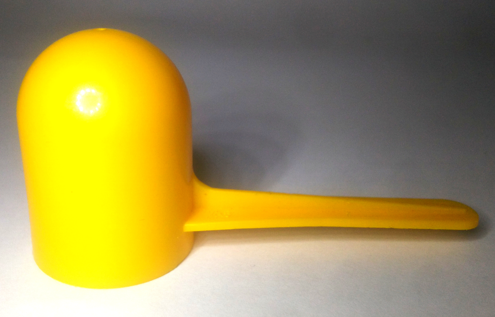
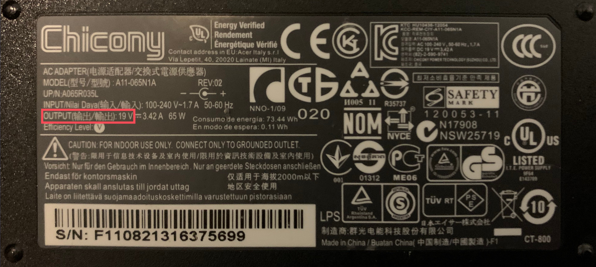

<h1 align="center" style="font-weight: bold">
    Vibing Cheese
</h1>

    
    
    
    

    
    

    

---

Website: [vibing-cheese.whinyaan.xyz](https://vibing-cheese.whinyaan.xyz)

Github: [github.com/whinee/vibing-cheese](https://github.com/whinee/vibing-cheese)

---

To be updated, be sure to watch this repository and join the [Discord Support Server](https://discord.com/invite/JbAtUxGcJZ) for this and other projects.

Interested in commissioning projects? Inquire through Discord(<a target="_blank" href="https://discord.com/users/848092597822160907">whi_ne#4783</a>) or through e-mail(<a target="_blank" href="mailto:whinyaan@protonmail.com">whinyaan@protonmail.com</a>). Price starts at 30 USD.

<h2 id="wtf"><b>What The Fuck Is This?</b></h2>

A DIY vibrator for sexy, alone time! This is a tutorial for making one with the bare minimum tools, materials, and minimal money spent. This tutorial is only meant for people that possess a biological male genitalia and for external use only, as I do not have a female one and do not know how to handle it. However, one can take inspiration from it, and make amends to make it suitable for a biological female body, or for internal usage.

This tutorial is dedicated to my girlfriend from 15 hours away in timezone relative to mine, and whom I wanna share the joys of using a vibrator, even if DIY'd.

## **Important**

By accessing and utilizing the information in this tutorial, you confirm that you have read you agree to the [license](LICENSE.md) agreement, and confirms to have wholly understood the [disclaimer](DISCLAIMER.md) and [terms of usage](TERMS-OF-USAGE.md), understand their contents, and accept the associated risks. If you do not agree with any part of this disclaimer, please refrain from using the tutorial and discontinue any further engagement with it.

Also yes, I'm a girl. Yes, I have a dick. Deal with it.

## **Contacts**

Hereunder my contacts in different platforms, and how much I check the messages in my accounts.

    

- Discord Tag: <a target="_blank" href="https://discord.com/users/848092597822160907">whi_ne#4783</a> (All the time)
- Twitter: <a target="_blank" href="https://twitter.com/whi_nyaan">whi_nyaan</a> (Weekly)
- Reddit: <a target="_blank" href="https://reddit.com/user/whi-nyaan">whi-nyaan</a> (Monthly)
- Github: <a target="_blank" href="https://github.com/whinee">whinee</a> (How would you contact me through Gthub????)
- E-mail: <a target="_blank" href="mailto:whinyaan@protonmail.com">whinyaan@protonmail.com</a> (Practically never)

## Donate

If you like the following tutorial, please consider donating to me through the following mediums. Each cent will go to development of other wonderful tutorials like this, other open source programs like in my [Github Account](https://github.com/whinee), and to my schooling. I am a 17 year old self-taught programmer and will go next year to a state university to study computer science. While it is free, my living expenses will be not. So yeah, even a cent will be appreciated.

- PayPal.me: [paypal.me/whinyaan](https://paypal.me/whinyaan)
- PayPal Donate: [paypal.com/donate/?hosted_button_id=9YR5JDDEQABKG](https://paypal.com/donate/?hosted_button_id=9YR5JDDEQABKG)

## **Materials**

Hereunder the list of materials, prerequisites to getting the materials, where you (a peasant, I presume) could get those materials for cheap or even for free, substitutes for said materials, and whatnot. I recommend for you to read all of the following text, except for the small text, as they are just some shitty commentary. The items that are preceded with a red circle (&#x1F534;) are required for following this tutorial.

- Mounting Tape

    

- &#x1F534; Electrical Tape

    

    <small>I got this at my dad's drawer, and that's why it is dusty huhuuu</small>

- &#x1F534; Sandpaper

- &#x1F534; Lots of Screws!

    

    Find any small to kind-of-small sized screws, bolts, nuts, or anything that is heavy and small.

- &#x1F534; Cable Ties

    

    For this project, I recommend for you to get a couple of these. But if you are really ***that*** low on budget, one could suffice. Just make sure that you do not mess up the first time you do this.

- &#x1F534; DC motor with gear attached to the shaft

    

    You can get these motors from optical readers (the one that reads CD/DVD discs), remote controlled toy cars or any toys that can spin on its own really, and whatnot.

    According to my girlfriend's research, she can get one on Walmart for around 14 CAD

    

    It is recommended to know the voltage rating of the motor that you will be using for this project. From my (<small>very un-scientific</small>) testing, passing 12V to a 3V motor and using that for this project will result in minor burns. Take note of the voltage rating of the motor for later.

    In this tutorial, I will be using a motor with a voltage rating of 3 volts.

- &#x1F534; Milk scoop

    
    

    After finding a DC motor, find a milk scoop that can fit the DC motor and has a constant diameter all throughout its height, preferably with less than 3mm of distance from the highest point of the DC motor and the inner diameter of the milk scoop. You can also find something cylindrical shaped with one end closed, preferably a spherical end. However, the same condition said above still applies.

- &#x1F534; Power Supply

    The power supply you will be using will be dependent on the voltage rating of the motor you will be using. It is recommended to have a power supply that will perfectly match the voltage rating of the motor. However, if no power supply perfectly matches your motor, it is recommended to use power supplies with higher voltage output rather than lower voltage output. This has no basis, but using a power supply with an output voltage not exceeding double that of the voltage rating of the motor will be probably fine. From my testing, using 5 volts for a 3 volts motor is fine.

    You can see the voltage rating of a power supply typically in its body, either as a label engraved or embossed, or in a sticker.

    Here are the examples of power supplies and highlighted with the red box are their output voltage:

    

    <small>Picture took by my gf</small>

    

    <small>Picture took by my gf</small>

    

    <small>Picture took by my gf</small>

    Power supplies for 9 volts and higher often come with their cords attached directly to the power supply. This cord will be destroyed for the purpose of making this project, so make sure that you will not be using the power supply anymore.

    In this tutorial, I will be using a power supply with 5 volts, as my motor is rated for 3 volts, and I cannot find a power supply that has that output voltage. In this case, it is a phone charger, with the (<small>broken</small>) Micro USB to USB A connector.

    

    

## **Tools**

Hereunder the list of tools that one will or might need while following this tutorial.  The items that are preceded with a red circle (&#x1F534;) are required for following this tutorial.

- &#x1F534; Scissor

    You probably know what a scissor is. This will be used for cutting the electrical tape, mounting tape, cable, and whatnot.

- &#x1F534; Pliers

    This will be uses for removing the gear from the shaft of the motor.

- Wire Strippers

    I do not own one, and thus cannot put a picture of it in here. If you do have one, you can use it for stripping insulation from wires. Otherwise, scissors, your nails, and a bit of elbow grease will do the trick.

## **Instructions**

1. Get your milk scoop, and with a scissors, cut the handle at the very root.

    

1. In the milk scoop, there are bound to have a bit of plastic left in it. So, with a sandpaper, carefully sand it away until the surface has no more protruding plastic in it.

    

    It is recommended to cut a strip of sandpaper with the width of the handle you are trying to shave off, as having any more than that will cause some plastics in the already smooth surface of the scoop to shaved off, leaving rugged marks and may cause irritation.

1. Clean the milk scoop with soap and water so that it is sanitized, and to also remove the bits of plastic still left after sanding it.

1. Get the power supply you have picked. In this tutorial, as my motor is rated for 3 volts and I only got a mobile phone charger with an output of 5 volts, I will be using that.

    

1. With the scissor, cut the very end of the power supply's cable.

1. Using the scissor, carefully cut the insulation approximately 2 cm away from the cut made earlier until you see another set of insulation, or see copper. In my case, I have saw another set of insulation.

    Using your fingernails, carefully strip away the insulation from the wire. Apply medium force, as applying more force might result in breaking your nails. If it does not budge, rotate the scissors around the cut and slowly eat at the insulation, and repeat. Be careful not to cut the wire underneath the insulation.

    If you have a wire stripper, use it appropriately for this task.

    If you have stripped a micro USB to USB A charging cable like I did, you should see two or four insulated wires like the following:

    

    If you saw four insulated wires, focus only on the red and black wires.

    In my case, mine had red and blue wires.

    

    If your wire still has more insulation, follow the instructions above for stripping the insulation. But instead of doing it 2 cm away from the cut made earlier, do it 1 cm away. You should have the following wire now:

    

1. Next, find a screw that will fit between the gear and the outer diameter of the motor.

    

    

    In my case, it is a small bolt. Make sure that the height of the screw will not exceed the height of the milk scoop.

1. After finding the perfect screw or whatever, remove the gear from the shaft. If you have pliers, you can use it to grip the gear, then pull it away from the shaft. Otherwise, you can use a small cloth to wrap around the gear, then remove it with your hands. If it does not budge, it is highly recommended to borrow pliers from your friendly neighbor as there is no other way to do this safely.

1. Tie the gear and the screw together in place with a cable tie.

    

    In my case, I made mine upside down as it was easier for me to work with.

    Make sure that the lowest point of the gear matches with the lowest point of the screw, as we do not want the screw scraping the body of the motor when it runs.

    Using the scissor, cuz the excess of the cable tie.

    

1. With a generous amount of force, put the gear back to the shaft of the motor.

1. Connect the two wires of the power supply to the positive and negative wires of the motor. If the wire is not yet stripped, follow the instructions on how to strip a wire in step 6.

    If the motor does not come with a wire, it should come at least with two leads. Connect each of the wires to one of the leads.

    Make sure that the different wires does not touch each other.

    Then, with enough electrical tape, cover where the wires connect to.

    Make sure that the screw's path will not be obstructed when it rotates.

    

    

1. Check how it all fits in the milk scoop.

    If it is not quiet the perfect fit, in combination with electrical tape and some paper, wrap the sides of the motor, just until the motor fits the milk scoop perfectly. If you have a mounting tape, use that.

    Then carefully, push the motor inside the milk scoop until all of it is enclosed. It is recommended to have the cable protruding out to the side where the handle previously was. This is as there might still be bits of plastic protruding from it, and the sandpaper might have made the surface on that side rugged and can cause irritations when rubbed in the skin for excessive periods.

    

    Electrical and mounting tape are sticky, so wash your hands afterwards. Then, dry it off. We haven't even masturbated with this thing, but already have to wash our hands from dealing with sticky stuff hehe~

1. And now, you are done!

    

    

    If you have wet wipes with alcohol content, or alcohol, use it to clean the outside of the milk scoop. This is to remove the adhesive residue if the electrical/mounting tape ever got into contact with it. It can also help with sanitizing the vibrator.

## **Using For The First Time**

After building the vibrator, you are now probably excited to use it. But we have to take precautions.

### **Testing**

First, plug the vibrator to the mains outlet and see if it works. If it does work, and no smoke, sparks, or a popping sound occurred, then that is a good sign. If any of those things happened, immediately unplug from the mains outlet.

<h3 id="what-to-do-if-it"><b>What To Do If It...</b></h3>

<h4 id="what-to-do-if-it-doesnt-work"><b>Doesn't Work</b></h4>

Disassemble the vibrator, and redo the wiring. Make sure that the two wires are not touching each other, or any of the metallic parts of the motor, except for the leads if it does have that.

If it still does not work, replace the power supply with a lower voltage rating, re-wire everything, and test if it works. Do it over and over until you have no more power supply with a lower voltage.

If it still does not work, replace the motor with another one, repeat the tutorial, and check if it works.

<h4 id="what-to-do-if-it-sparks"><b>Sparks</b></h4>

Disassemble the vibrator, and redo the wiring as described in "[What To Do If It Doesn't Work](#what-to-do-if-it-doesnt-work)".

<h4 id="what-to-do-if-it-smokes"><b>Smokes</b></h4>

If it smokes, that might be an indication of a short circuit, overloading, or a defect in the motor. Disassemble the vibrator, and redo the wiring as described in "[What To Do If It Doesn't Work](#what-to-do-if-it-doesnt-work)". Plug it again and see if it works.

If it still smokes, then it might be an indication of overloading or having a defect in the motor. Replace the power supply as described in "[What To Do If It Doesn't Work](#what-to-do-if-it-doesnt-work)"

If it still smokes, then it might indicate a defect in the motor. Replace the motor with another one, repeat the tutorial, and check if it works.

<h4 id="what-to-do-if-it-makes-a-popping-sound"><b>Makes A Popping Sound</b></h4>

If it makes a popping sound, it might be caused by the screw hitting the milk scoop. Replace the screw with a smaller one, or find a milk scoop with a bigger diameter, then repeat the tutorial.

If it still makes a popping sound, then it might be an indication of overloading or having a defect in the motor. Replace the power supply as described in "[What To Do If It Doesn't Work](#what-to-do-if-it-doesnt-work)".

If that does not work, replace the motor with another one, repeat the tutorial, and check if it still makes a popping sound.

<h4 id="what-to-do-if-it-heats-up"><b>Heats Up</b></h4>

Having a vibrator that becomes warm to touch when gets powered on indicates that it is doing its really best to pleasure you, and is blushing from doing so. Jokes aside, if it is hot enough that it can burn, then it might be an indication of a short circuit, overloading, or a defect in the motor.

Disassemble the vibrator, and redo the wiring as described in "[What To Do If It Doesn't Work](#what-to-do-if-it-doesnt-work)".

If it still heats up, then it might be an indication of overloading or having a defect in the motor. Replace the power supply as described in "[What To Do If It Doesn't Work](#what-to-do-if-it-doesnt-work)".

If it still heats up, then replace the motor with another one, repeat the tutorial, and check if it still heats up.

<h4 id="what-to-do-if-it-the-instruction-above-doesnt-work"><b>The Instructions Above Doesn't Work</b></h4>

You can contact me thru my [contacts](#contacts) to get help. I will appreciate it if you document everything as much as possible. This will not only help me help you even better, but it will also help others as I update this tutorial to cover scenarios that I have not thought of yet, and possible mitigations and fixes for them.

### **Stress Testing**

Now that your vibrator pass the initial testing, it is now time to stress test it.

Basically, what you need to do is to have the vibrator powered on at a set amount of time, to see if it does something unusual. It is recommended to do so for about double the time of your usual length of your average masturbation session. If it does something unusual, then refer to "[What To Do If It...](#what-to-do-if-it)".

This stress testing step is initially added in as my earlier iterations of the vibrator was heating up so damn much while I am wearing them, or that the screw keeps detaching itself. It is pretty frustrating to use a toy, only for that very same toy to ruin you orgasm cuz' it dies mid-session.

If it does not do anything unusual, then you are now good to use it!

## **Usage**

I know you are raring to use this thing already, but c'mon, take a bit more care of yourself. Nothing wrong at taking precautions. Don't you worry, this is the very last step before you can use this thing.

### **Before Using**

Sanitize the casing of the vibrator with wet wipes, preferably with alcohol content, or with alcohol and cotton or clean cloth.

### **Using**

I do not own a proper vibrator, and as such, do not know how to properly use one.

But my use case is for strapping it in the back my biological male genitalia. To do so, you will need a rubber band. Get yourself different kiinds of rubber bands. To test if it is suitable, put the rubber band in ur thumb and index finger then begin stretching it. If it feels like you are not using a significant force to stretch it, but still manages to push back, it is suitable for use. With this rubber band, form a double loop, then put it halfway on the case of the vibrator. Get one of the loops, then carefully put it on your genitalia until the rubber band loop is just under the head of said genitalia. Then, gently, rotate the vibe until it is behind your genitalia.

Enjoy!

### **After Using**

Wipe off the bodily fluids off the vibrator with wet wipes, preferably with alochol content, or with alcohol and cotton or clean cloth. Then, get a clean ziploc bag or food-safe container, then put the thing inside for storage.
